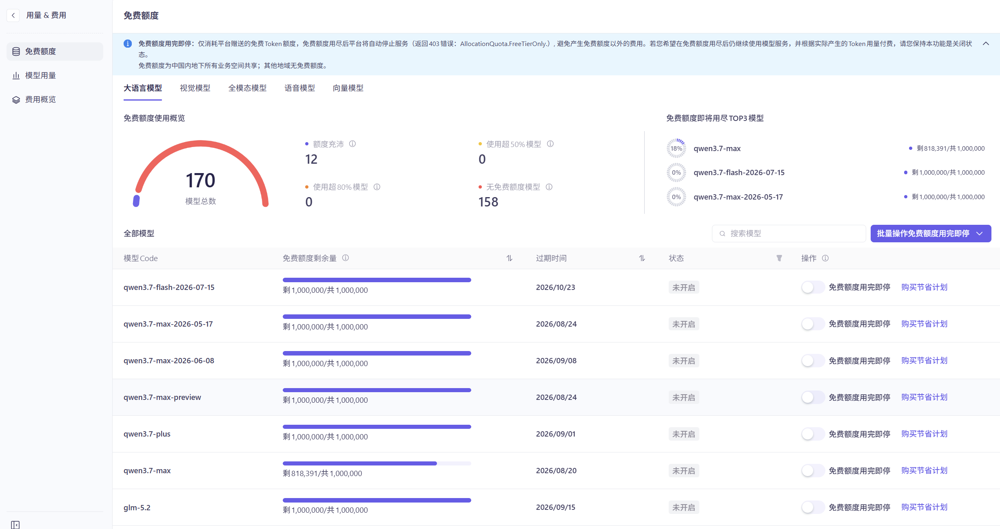
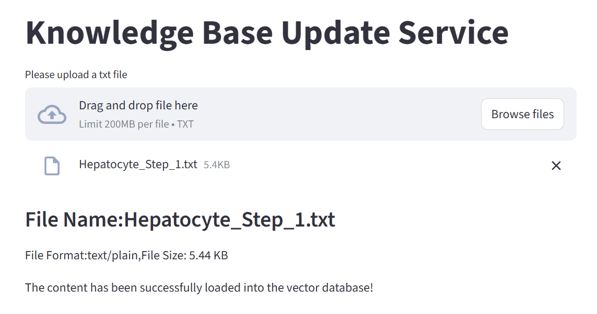
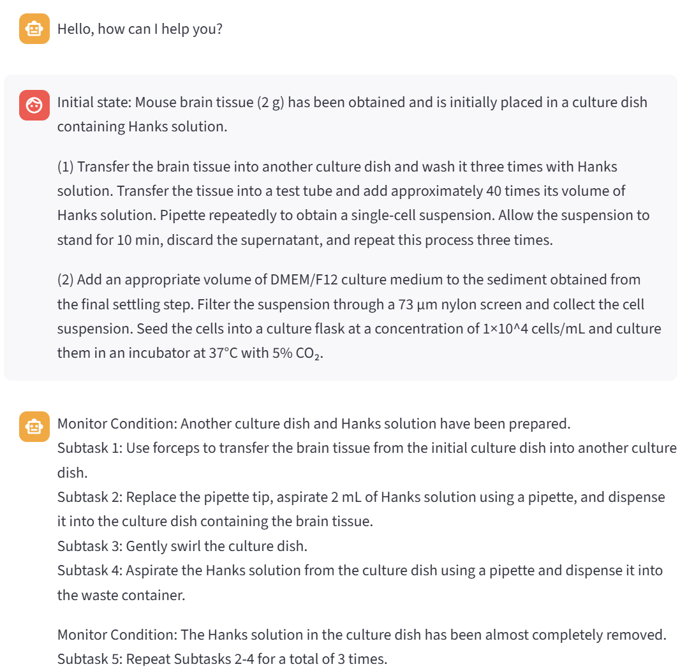
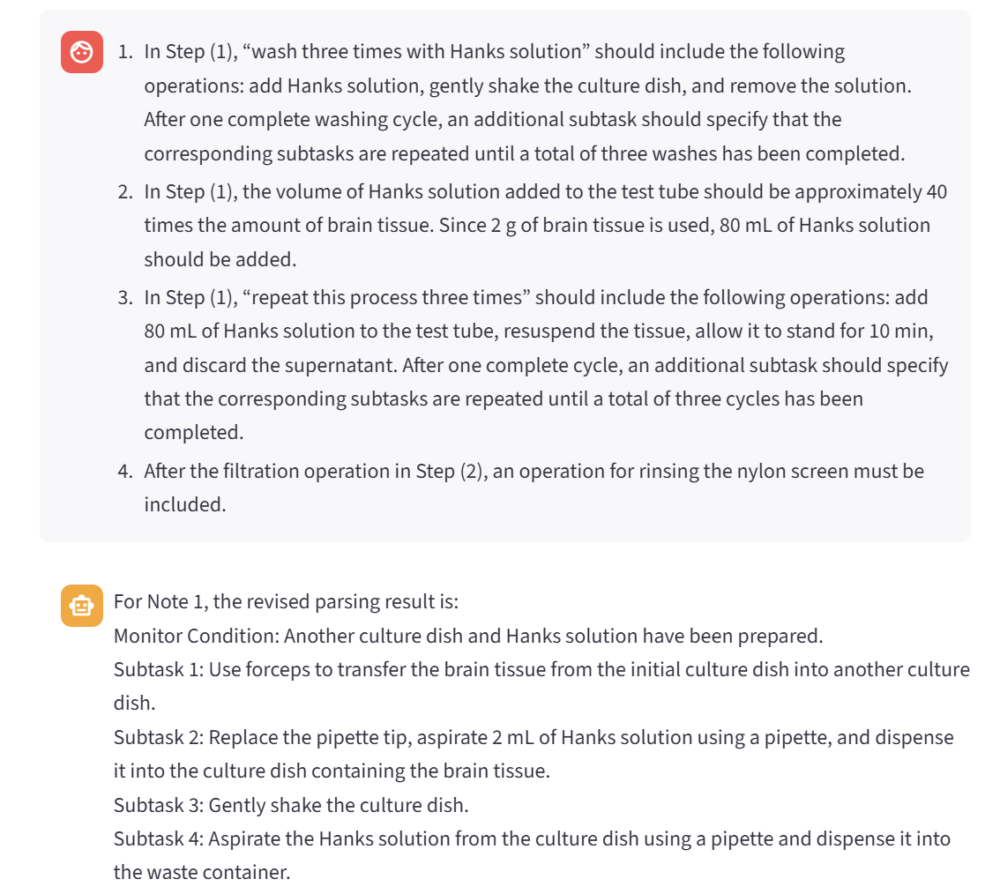
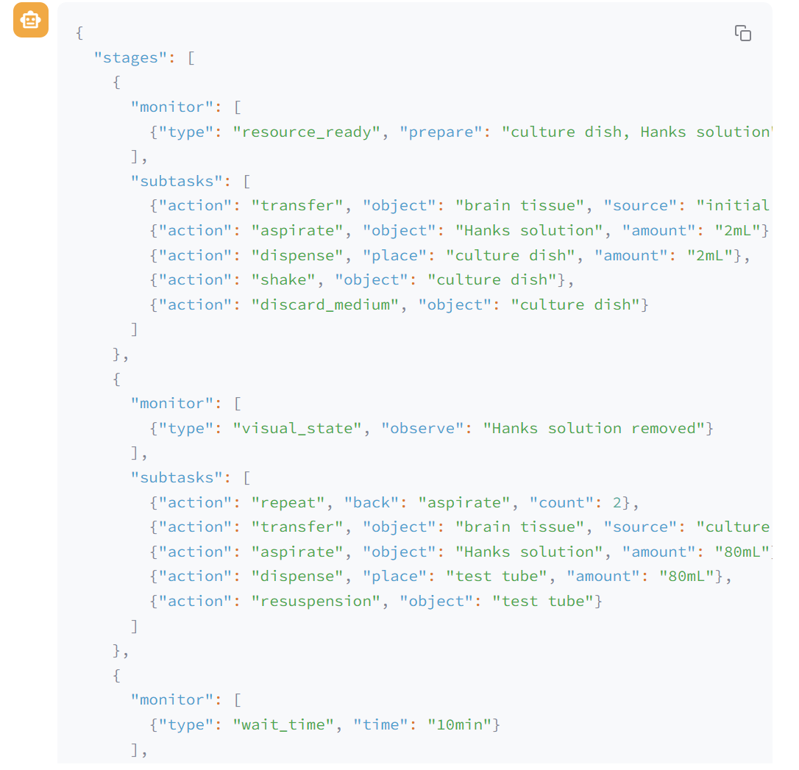

# ProtoAct

ProtoAct is a Streamlit-based assistant for parsing biological experiment protocols into automation-ready workflows. It combines a local RAG knowledge base, a large language model, and an ActSchema-style action space to convert free-text protocols into:

- monitor conditions and fine-grained executable subtasks;
- structured JSON action-function sequences for downstream evaluation.

The project is intended for protocol interpretation experiments in biological laboratory automation, especially workflows that need to bridge natural-language experimental procedures and robotic action primitives.

## Features

- Upload protocol references and manual annotations into a persistent Chroma vector database.
- Parse raw biological protocols into monitor-condition and subtask sequences.
- Refine parsing results through multi-turn feedback and protocol-specific notes.
- Map parsed monitor/subtask sequences into structured JSON action functions.
- Evaluate predicted JSON sequences against manually annotated ground truth with precision/recall, BLEU, SciBERTScore, and Levenshtein-distance based metrics.

## Project Structure

```text
.
|-- app_file_uploader.py          # Streamlit app for uploading reference txt files
|-- app_qa.py                     # Streamlit chat app for protocol parsing
|-- config_data.py                # Local paths, retrieval settings, and session id
|-- knowledge_base.py             # Text splitting, MD5 deduplication, and Chroma ingestion
|-- rag.py                        # RAG chain, prompt, chat model, and parsing rules
|-- vector_stores.py              # Chroma retriever configuration
|-- requirement.txt               # Python dependencies
|-- data/
|   |-- upload_knowledge_database/ # Example protocol-reference txt files
|   |-- monitor_and_action_space.txt
|   |-- json_example.txt
|   `-- ProtoAct_Prompt.txt
|-- evaluation/
|   |-- test_data/                # Example ground-truth and predicted JSON files
|   |-- result/                   # Excel result templates/output files
|   `-- json_*.py                 # Evaluation scripts
`-- docs/images/                  # README screenshots
```

## Installation

ProtoAct is a Python project. Python 3.10 or later is recommended.

```bash
python -m venv .venv
```

On Windows:

```bash
.\.venv\Scripts\activate
```

On macOS/Linux:

```bash
source .venv/bin/activate
```

Install dependencies:

```bash
pip install -r requirement.txt
```

> Note: the dependency file in this repository is named `requirement.txt`.

## Configure Bailian

ProtoAct uses Alibaba Cloud Bailian for both the large language model and embeddings.

1. Create an API key in the Alibaba Cloud Bailian console.
2. Choose an available chat model code, such as a Qwen model that is enabled for your account.
3. Configure the model and API key in the current codebase:
   - `rag.py`: `ChatTongyi(model="...", api_key="...")`
   - `knowledge_base.py`: `DashScopeEmbeddings(dashscope_api_key="...", model="text-embedding-v4")`
   - `vector_stores.py`: `DashScopeEmbeddings(dashscope_api_key="...", model="text-embedding-v4")`

<details>
<summary>Bailian console screenshots</summary>




</details>

## Step 1: Build the Reference Knowledge Base

Start the reference-upload application from the project root:

```bash
streamlit run app_file_uploader.py
```

Open the local Streamlit URL, usually:

```text
http://localhost:8501
```

Upload one `.txt` reference file at a time. The repository includes several example reference files in:

```text
data/upload_knowledge_database/
```

Uploaded content is split and stored in the local Chroma database under `chroma_db/`. ProtoAct records the MD5 hash of each uploaded file in `md5.text`, so the same file content is not inserted repeatedly.



## Step 2: Parse Biological Protocols

Stop the uploader app or use another Streamlit port, then start the parsing assistant:

```bash
streamlit run app_qa.py
```

Paste a raw biological experiment protocol into the chat input. ProtoAct retrieves relevant reference fragments from Chroma and asks the LLM to generate monitor conditions and fine-grained subtasks.



You can then provide protocol-specific notes, constraints, or correction requests. ProtoAct keeps the conversation history and uses the feedback to revise the parsing result.



If you are using the BioP2E dataset separately, `original_protocol.txt` can be used as the raw input and `protocol_specific_notes.txt` can be used to guide revision.

## Step 3: Generate JSON Action Sequences

After obtaining the monitor conditions and subtask sequences, paste that sequence back into the chat. ProtoAct maps it to a structured JSON action-function sequence based on the available monitor conditions and action primitives.

The action schema and examples are defined in:

```text
data/monitor_and_action_space.txt
data/json_example.txt
```

Edit these files if your experiments require new monitor condition types, new action primitives, or different parameter names.



## Conversation History

The chat app stores conversation history under `chat_history/`. The active session id is configured in `config_data.py`:

```python
session_config = {
    "configurable": {
        "session_id": "user_001"
    }
}
```

Long histories can increase token usage. To start a fresh session, change the `session_id` value or manually clear the corresponding history file.

## Evaluation

The `evaluation/` directory contains scripts for comparing predicted JSON action sequences with manually annotated ground truth.

Available metrics:

- `json_precision_recall.py`: precision, recall, and F1 for monitor-condition types and action names.
- `json_precision_recall_for_arguments.py`: precision, recall, and F1 for parameter names.
- `json_bleu.py`: BLEU scores for matched parameter values.
- `json_sciBert.py`: SciBERTScore-style semantic similarity for matched parameter values.
- `json_levenshtein.py`: sequence-order difference based on Levenshtein distance.

Example JSON files for an osteoclast protocol are included in:

```text
evaluation/test_data/
```

Before running an evaluation script, edit the script-level settings near the bottom of the target file:

- `cell_names`
- `gt_data`
- `pred_data`
- `model_name` in `new_row`

Run the scripts from inside `evaluation/`, because their paths are relative to that directory:

```bash
cd evaluation
python json_precision_recall.py
python json_precision_recall_for_arguments.py
python json_bleu.py
python json_sciBert.py
python json_levenshtein.py
```

Results are appended to the corresponding Excel files in:

```text
evaluation/result/
```
